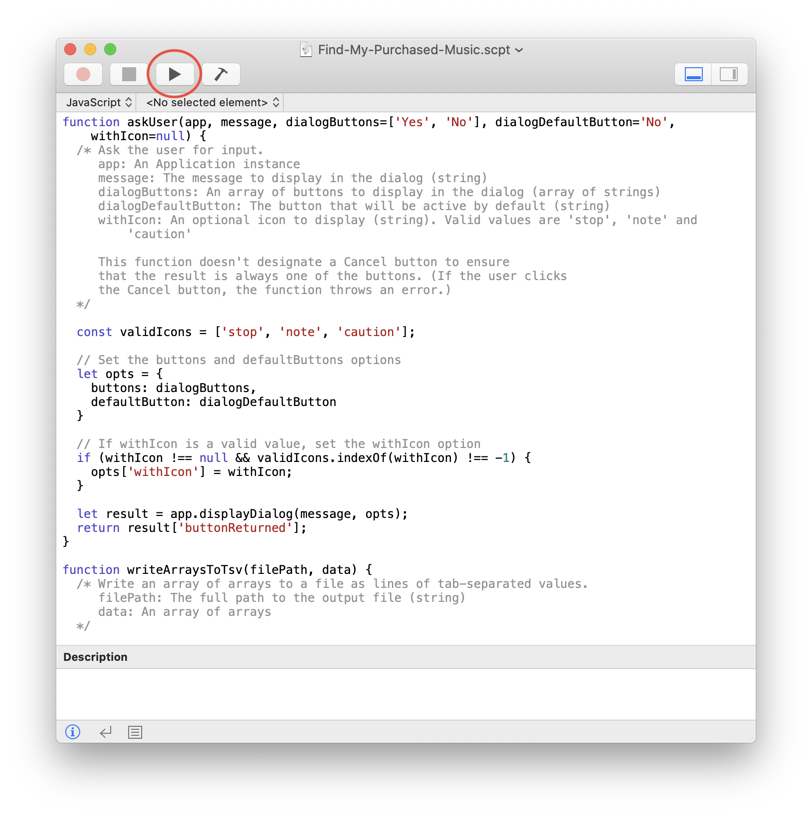
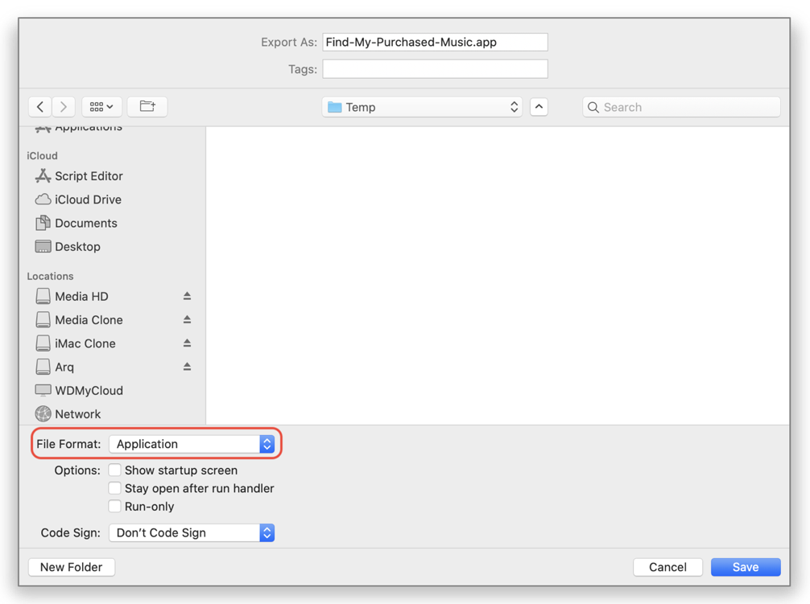
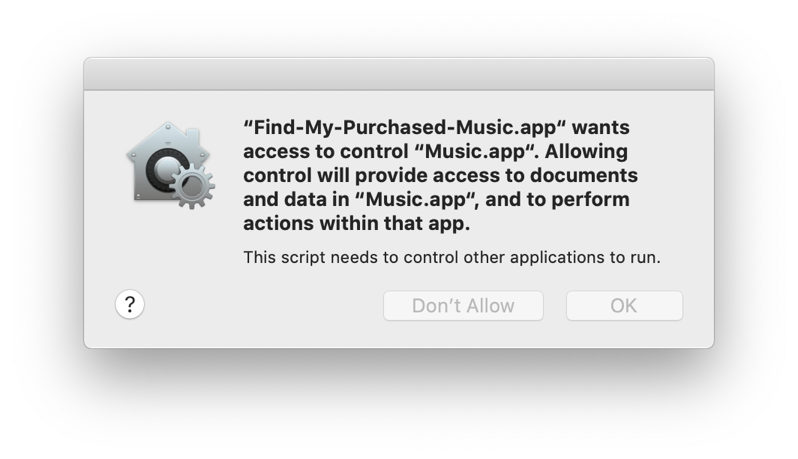
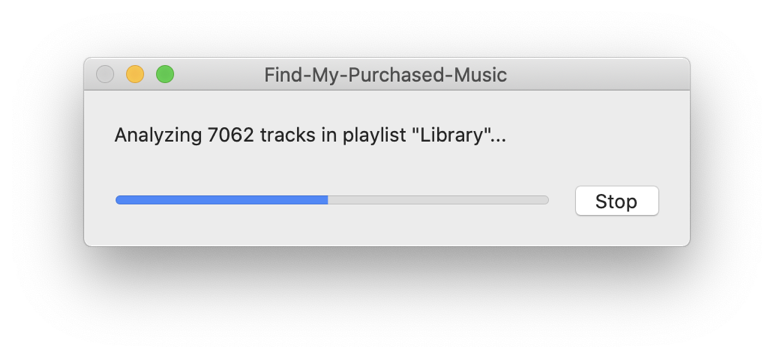
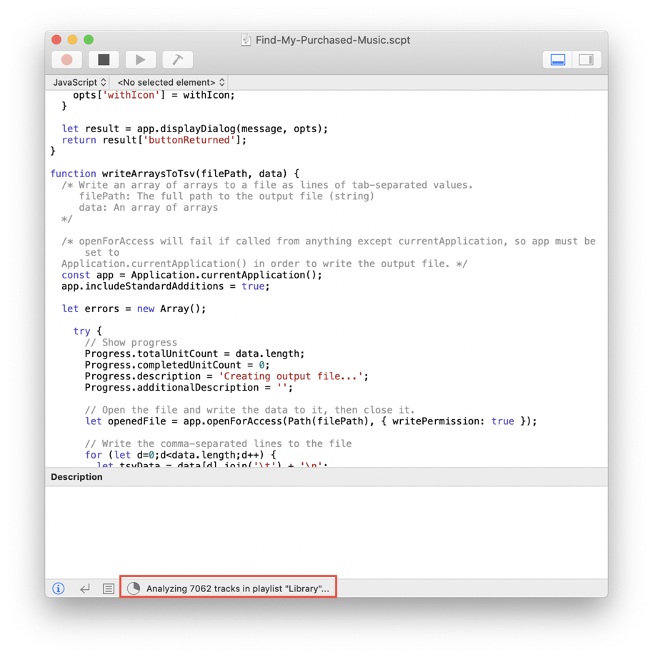

# Find My Purchased Music

*Find My Purchased Music* is a JXA ([JavaScript for Automation](https://developer.apple.com/library/archive/documentation/LanguagesUtilities/Conceptual/MacAutomationScriptingGuide/index.html)) script for macOS Catalina (10.15) and Mojave (10.14). It analyzes the songs in your music library and shows which songs you own and which songs are Apple Music tracks.

## How to Run the Script

### Option 1: Run the script with Script Editor

You can run [Find-My-Purchased-Music.scpt](Find-My-Purchased-Music.scpt) as-is using Script Editor, which is already installed on your Mac. Just [download the file](Find-My-Purchased-Music.scpt), double-click it and click the Run button (circled in red in the image below) in Script Editor.

### Option 2: Save the script as an application

You can also save the script as an application and then run the application by double-clicking it. Follow these steps to save it as an application.

1. [Download the script](Find-My-Purchased-Music.scpt) and double-click it to open it in Script Editor.
2. In Script Editor, click **File > Export**.
3. Select a folder, give the application a name and select "Application" for the File Format. Then click **Save**.

After you've saved the script as an application, just double-click the application to run it.

## Permissions

The application will ask for permission to control the Music app the first time you run it. (It won't ask for permission if you run the script in Script Editor.)

## Select one or more playlists

The first thing the script (or application) does is ask you to select one or more playlists.

* To select multiple playlists, hold down the command (⌘) key and click each playlist.
* If you want to analyze all of your music, select *Library* or *Music*.

## Select the output format

The script will output the list of songs as an HTML file or a tab-separated values (TSV) file. Select TSV if you want to open the file in Excel, Numbers or another spreadsheet application.

## Enter a name for the output file

The script will prompt you to select a folder and enter a name for the output file. The file extension will be added automatically.

## Script progress

The script will now start analyzing the songs in the selected playlist(s). Depending on the number of songs to analyze, the script may run for a few seconds or a few minutes.

If you save the script as an application and run the application, a dialog will show the progress. (It may initially be hidden behind other windows on your desktop.)

If you run the script in Script Editor, the progress is shown in the lower left of the Script Editor window.

## Output file

When the script finishes, a dialog will show the name of the file.

## Modifying the script

If you want to modify the script, I recommend [downloading the JavaScript file](Find-My-Purchased-Music.js) and editing it since most editors know JavaScript syntax highlighting. You can then save it with a `.scpt` extension and run it from Script Editor. (If you use [Visual Studio Code](https://code.visualstudio.com/), you can install the AppleScript extension and run the script in Visual Studio Code.)

## License

The code is released into the public domain. (See the [LICENSE](LICENSE) file.)

